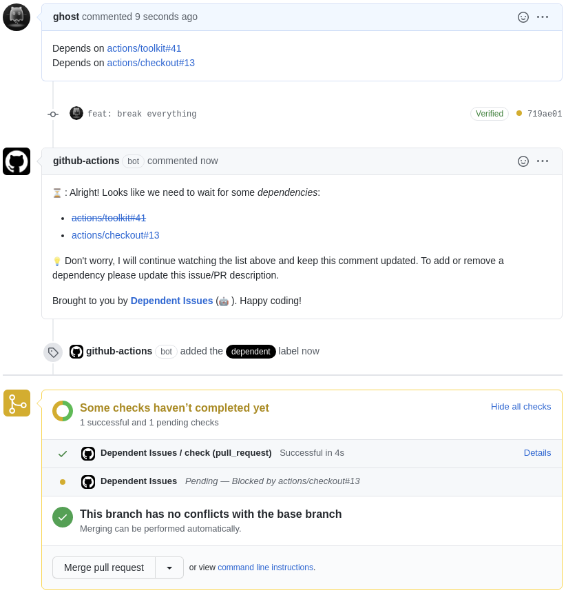

# Dependent Issues

> A GitHub Action for marking issues as dependent on another

It works with PRs and issues and supports cross-repository dependencies.

## Usage

Create `.github/workflows/dependent-issues.yml` with the following content:

```yaml
name: Dependent Issues

on:
  issues:
  pull_request:
  schedule:
    - cron: '0 0 * * *' # schedule daily check

jobs:
  check:
    runs-on: ubuntu-latest
    steps:
      - uses: z0al/dependent-issues@v1
        env:
          # (Required) The token to use to make API calls to GitHub.
          GITHUB_TOKEN: ${{ secrets.GITHUB_TOKEN }}
        with:
          # (Optional) The label to use to mark dependent issues
          label: dependent

          # (Optional) Enable checking for dependencies in issues. Enable by
          # setting the value to "on". Default "off"
          check_issues: off

          # (Optional) A comma-separated list of keywords. Default
          # "depends on, blocked by"
          keywords: depends on, blocked by
```

Here how it can look like in practice:



## Inputs

- **label** (Optional): The label to use to mark dependent issues. Default `dependent`.
- **check_issues** (Optional): Enable checking for dependencies in issues. Enable by setting the value to `on`. Default `off`.
- **keywords** (Optional): A comma-separated list of keywords. Default `depends on, blocked by`.

## Environment variables

- **GITHUB_TOKEN** (Required): The token to use to make API calls to GitHub.

## Credits

Special thanks to [Jason Etcovitch](https://github.com/JasonEtco) for the original bot idea.

## License

MIT © [Ahmed T. Ali](https://github.com/z0al)
